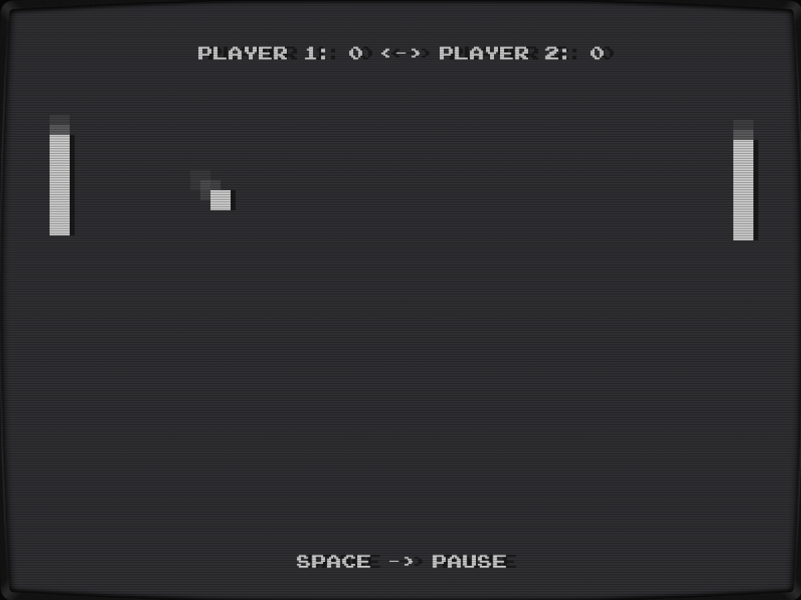

# Gong! - The Go Pong

Retro styled classic [Pong](https://en.wikipedia.org/wiki/Pong) clone based upon [ebiten](https://ebiten.org/) game framework.

With go installed, just type

```bash
git clone http://github.com/jenska/gong
cd gong
go run main.go
```

to start



## Thanks to

[OpenGameArt.Org](https://opengameart.org/)

## Soon to come

- ~~update package structure~~
- ~~stereo sounds~~
- ~~make window resizable~~
- AI support (beat the computer opponent, computer vs computer becomes more interessting)
- WebAssembly support
