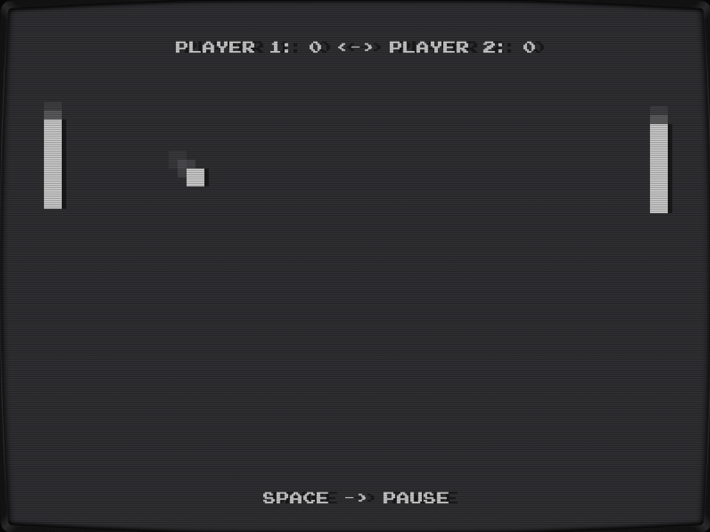

# Gong! - The Go Pong

Retro style Pong game based upon ebiten game framework.

With go installed, just type

```bash
go install github.com/jenska/gong
```

to start



## Soon to come

- ~~update package structure~~
- AI support (beat the computer opponent, computer vs computer becomes more interessting)
- stereo sounds
- WebAssembly support
