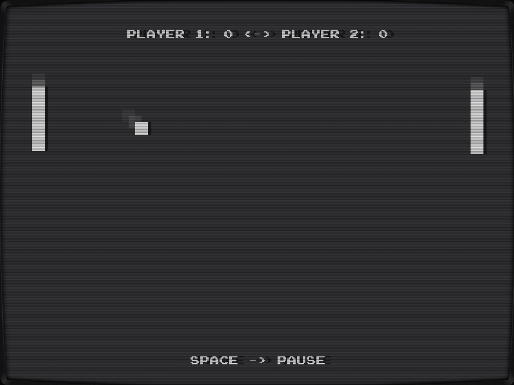

# Gong! - The Go Pong

Retro styled classic [Pong](https://en.wikipedia.org/wiki/Pong) clone based on the [Ebitengine](https://ebitengine.org/) game framework.

## Run from source

With Go **1.22+** installed, run:

```bash
git clone https://github.com/jenska/gong.git
cd gong
go run .
```



## Install

To build and install a standalone `gong` binary into your Go bin path:

```bash
go install
```

## Makefile targets

Common development tasks are available through `make`:

```bash
make run
make build
make test
make fmt
make tidy
```

## Controls

- `W` / `S`: move left paddle
- `↑` / `↓`: move right paddle
- `Esc`: quit

## Dependencies

Ebitengine requires additional native libraries on Linux.

### Debian / Ubuntu

```bash
sudo apt install libc6-dev libglu1-mesa-dev libgl1-mesa-dev libxcursor-dev libxi-dev libxinerama-dev libxrandr-dev libxxf86vm-dev libasound2-dev pkg-config
```

### Fedora

```bash
sudo dnf install mesa-libGLU-devel mesa-libGLES-devel libXrandr-devel libXcursor-devel libXinerama-devel libXi-devel libXxf86vm-devel alsa-lib-devel pkg-config
```

## Thanks

- [OpenGameArt.org](https://opengameart.org/)
